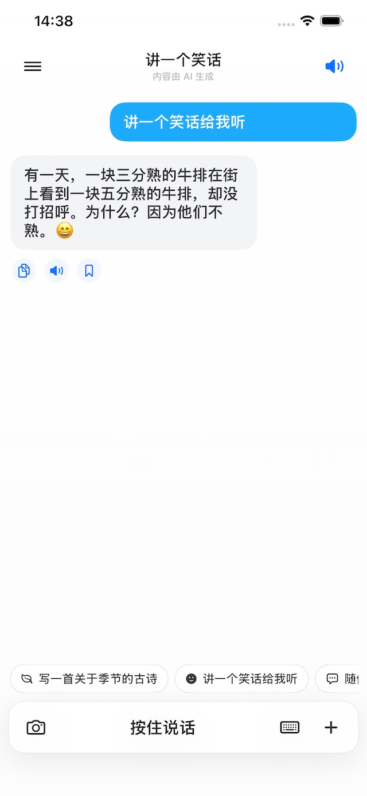
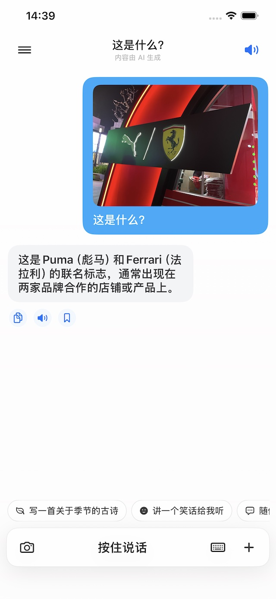

# hi-my-ai-chat

一个基于 SwiftUI 的 iOS 聊天应用，支持接入 OpenAI 兼容接口，提供流式回复、会话历史、搜索和语音输入。

<p align="center">
  
</p>
## 应用截图

| 文字聊天 | 图片理解 |
| --- | --- |
|  |  |

## 功能

- SwiftUI 原生 iOS 界面
- 支持填写 OpenAI 兼容 `Base URL`、`API Key`、`Model`
- 流式输出回复，带简单重试逻辑
- 本地保存聊天会话与搜索历史
- 支持语音输入

## 项目结构

```text
ios/hi-my-ai-chat
├── hi-my-ai-chat.xcodeproj
└── hi-my-ai-chat
```

## 运行方式

1. 用 Xcode 打开 `ios/hi-my-ai-chat/hi-my-ai-chat.xcodeproj`
2. 选择模拟器或真机
3. 编译运行应用
4. 在应用设置页填写：
   - `Base URL`
   - `API Key`
   - `Model`

## 隐私与公开仓库说明

- 仓库中不包含硬编码的真实 API Key、密码或私钥
- API Key 由用户在应用设置页输入，并保存在本机 `UserDefaults`
- `.gitignore` 已排除 `.DS_Store`、`xcuserdata` 等本地文件，避免将个人环境信息提交到仓库

## 注意

- 首次使用语音输入时，系统会请求麦克风和语音识别权限
- 如果你要在自己的 Apple 开发者账号下真机运行，需要在 Xcode 里设置自己的 Signing Team
