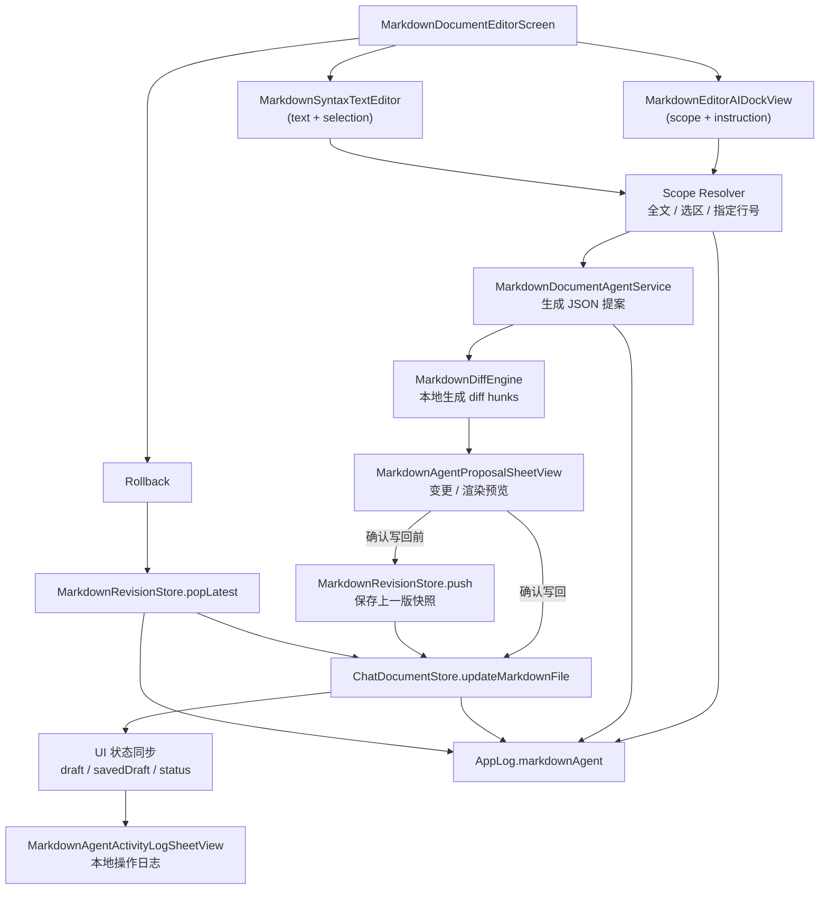

# Markdown Agent Architecture

## Flow

1. 编辑器读取本地 Markdown 文件，显示预览或编辑态。
2. 用户在底部 agent dock 输入修改指令，并选择范围：
   - 全文
   - 当前选区
   - 指定行号
3. `Scope Resolver` 把 UI 输入转成明确的 agent scope。
4. `MarkdownDocumentAgentService` 把全文、范围和指令发给模型，要求返回结构化 JSON 提案。
5. 客户端本地用 `MarkdownDiffEngine` 生成 line diff，不直接写文件。
6. `MarkdownAgentProposalSheetView` 展示：
   - 变更摘要
   - diff hunk
   - 渲染后的 Markdown 预览
7. 用户确认后，先由 `MarkdownRevisionStore` 保存上一版快照，再写回文件。
8. 用户可通过回滚按钮恢复上一版。
9. 所有关键动作同时写入：
   - 本地可读日志列表
   - `AppLog.markdownAgent` OSLog
